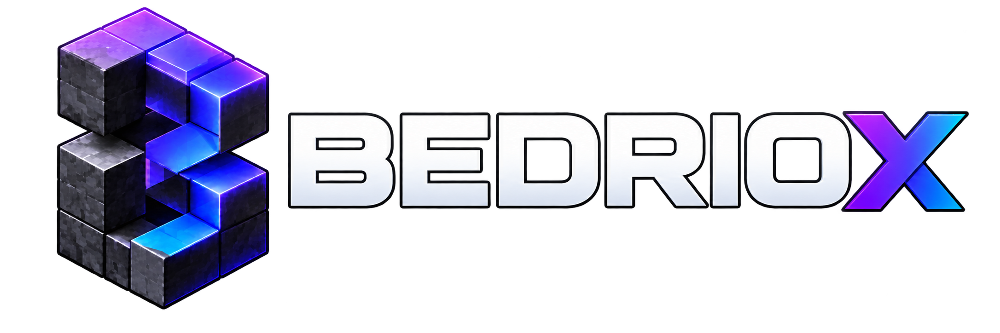

<p align="center">
  <a href="https://bedriox.com">
    
  </a>
</p>

<h1 align="center">Bedriox</h1>

<p align="center">
  A powerful, open-source Minecraft: Bedrock Edition server written in modern PHP.<br>
  Built with performance, customization, and community servers in mind.
</p>

<p align="center">
  <a href="https://github.com/Bedriox/Bedriox/actions/workflows/ci.yml"></a>
  <a href="LICENSE"></a>
  
</p>

Bedriox gives server owners a performance-focused foundation for creating Minecraft: Bedrock Edition experiences. The current playable foundation supports core multiplayer survival interactions while the project grows toward richer customization and a public plugin ecosystem.

## What Bedriox offers today

- **Playable multiplayer foundations** — synchronized players, movement, chat, inventories, block interaction, and a streamed flat world.
- **Responsive worlds** — bounded chunk generation and streaming keep nearby terrain moving smoothly as players explore.
- **Focused Bedrock support** — one qualified modern protocol family instead of years of legacy protocol code.
- **Modern PHP development** — strict types, Composer packages, automated tests, static analysis, and clear component boundaries.

## Where Bedriox is headed

Bedriox is being designed for vanilla-style survival, custom game modes, minigames, hubs, and modded experiences. The planned plugin API will let communities add commands, permissions, economies, moderation, custom mechanics, mobs, NPCs, and other server features without changing Bedrock protocol internals.

Bedriox is under active development. These expansion features are roadmap direction, not finished APIs, and behavior may change before the first stable release.

## Requirements

- 64-bit PHP 8.4 or newer (PHP 9 is not yet supported)
- Composer 2
- Windows x86-64 or Linux x86-64

## Development quick start

During private alpha development, clone the component repositories beside this repository:

```text
workspace/
|-- Bedriox/
|-- Protocol/
|-- RakNet/
`-- Data/
```

Then install and verify the server:

```shell
composer install
composer check
php bin/bedriox --version
php bin/bedriox serve
```

The exact component revisions are recorded in [`bedriox.lock.json`](bedriox.lock.json). See the [development guide](docs/development.md), [usage and configuration guide](docs/usage.md), [architecture](docs/architecture.md), and [testing guide](docs/testing.md) for contributor details.

## Project family

- [Bedriox](https://github.com/Bedriox/Bedriox) — executable Minecraft: Bedrock Edition server
- [RakNet](https://github.com/Bedriox/RakNet) — UDP and RakNet transport
- [Protocol](https://github.com/Bedriox/Protocol) — Bedrock packet codecs and protocol behavior
- [Data](https://github.com/Bedriox/Data) — versioned Bedrock registries and generated data
- [Docs](https://github.com/Bedriox/Docs) — installation, administration, and plugin documentation

## Contributing

Bedriox is currently developed in private while its foundations settle. Contribution guidance is available in [CONTRIBUTING.md](CONTRIBUTING.md).

## License

Bedriox is free and open-source software licensed under the [GNU General Public License v3.0](LICENSE).

Developed by the [Veno Ninja LLC](https://bedriox.com) team. Bedriox is not affiliated with Mojang Studios or Microsoft. Minecraft is a trademark of Microsoft Corporation.
